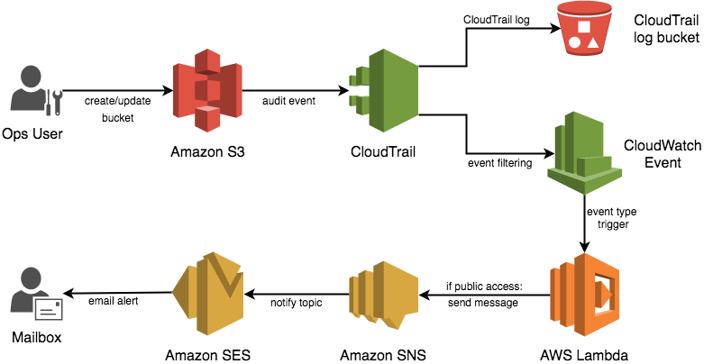

# Henry
_There's a hole in the bucket, dear Liza, dear Liza_
## Alert on Open S3 Buckets

This NodeJS lambda function is triggered by a Cloudwatch Event rule, processing CloudTrail API logs to find S3 bucket permissions changes, and sends a notification via SNS (pronounced 'snooze', fact) if the bucket has public read or public write access.

This is intended to help ensure you are aware when an S3 bucket is created or modified with public access (which could be desirable in some use cases). It will not prevent the bucket from being created.

### Overview

### Pre-requisites

- Terraform
- AWS credentials in `~/.aws`
- AWS CLI tools set up (to shell out to create sns email subscription)

Of course, if you just want to use the event parsing & notification lambda then just pluck out `index.js`

### Deployment

Included is a terraform script that will create all of the AWS resources necessary to immediately use this in your Amazon account, from CloudTrail log to SNS topic.

Before running the terraform script you'll need to package the lambda file: `zip lambda.zip index.js`

Two variables are prompted at template apply:
- `alert_email_address` for the target email address
- `cloudtrail_s3_bucket_name` for the cloudtrail log bucket name (must be globally unique)

### Lambda Configuration

If you are reusing the lambda by itself, the function depends on an environment variable called `snsTopicArn` which must be populated with the fully qualified ARN for your SNS topic.

### Further Development

- ~~Reading the CloudTrail event details and extracting the user ID of the person/role of the service that set the S3 bucket to public and including that in the notification message.~~ ☑️ **DONE**
- Changing the sns topic subscription from email to a HTTP endpoint may make it relatively easy to push messages to a Slack channel when someone creates/modifies a bucket with public permissions.